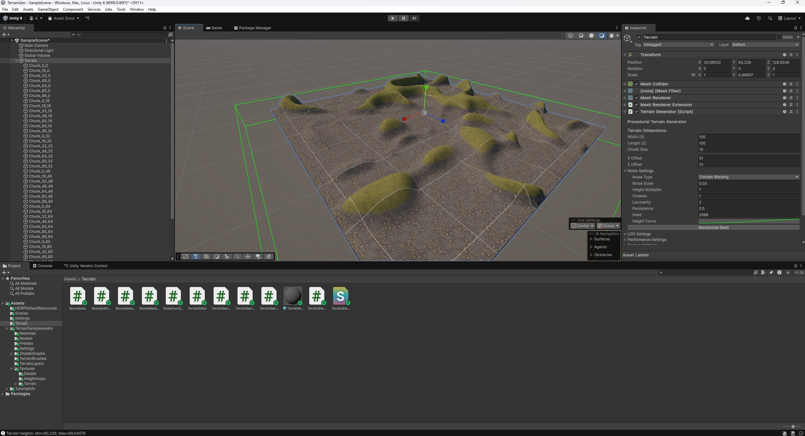

# Terrain Generator 🌄

**terrainGen** — это 3D-генератор процедурного террейна на Unity. Он позволяет создавать разнообразные ландшафты с помощью алгоритма шумов, поддерживает настройку параметров генерации, а также визуализирует террейн с помощью чанков.

## 🔧 Особенности

- Генерация террейна с помощью различных типов шума 
- Настраиваемые параметры генерации в инспекторе
- Разделение террейна на чанки
- Простая архитектура кода — легко расширять и модифицировать

## 🖼️ Скриншоты

 <!-- Обнови путь, если необходимо -->

